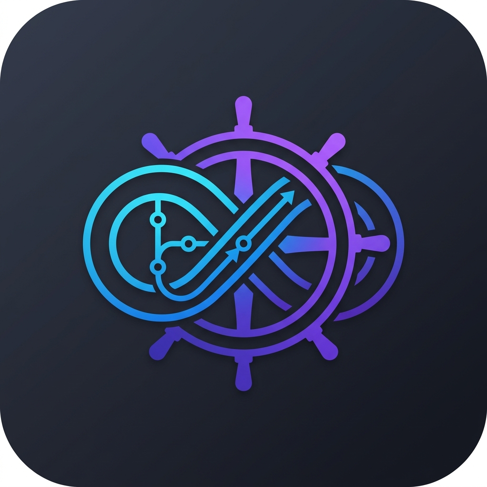

# GitOpsCTL: A Lightweight GitOps Control Plane for Kubernetes

<p align="center">
  
</p>

[](https://github.com/aeswibon/gitopsctl/actions/workflows/ci.yml)
[](https://goreportcard.com/report/github.com/aeswibon/gitopsctl)
[](https://opensource.org/licenses/MIT)

**GitOpsCTL** (GitOps Control Tool) is a minimalistic, self-hosted GitOps controller designed for speed, simplicity, and external management. It keeps your Kubernetes clusters in sync with Git repositories while providing a premium developer experience through a Terminal UI and rich observability.

## ✨ Key Features

- **🚀 Lightweight & External**: Run it anywhere (laptop, CI, edge) to manage one or many clusters from the outside.
- **🛠️ Multi-Engine Support**: Native support for plain **YAML**, **Kustomize**, and **Helm** (rendered in-memory).
- **📟 Premium TUI**: A beautiful interactive dashboard to monitor and manage your workloads.
- **🔒 Production Security**: Namespace-scoped restrictions and native **Mozilla SOPS** integration for secrets.
- **📊 Observability**: High-resolution Prometheus metrics, JSONL audit logs, and customizable webhooks.
- **⚙️ Manual & Auto Sync**: Choose between fully automated deployments or a human-in-the-loop approval workflow.

---

## 📖 Documentation

- **[🚀 Getting Started](docs/getting-started.md)**: Your first sync in 5 minutes.
- **[📥 Installation](docs/installation.md)**: Binary, Docker, and Source build guides.
- **[⚙️ Configuration](docs/configuration.md)**: How to define Applications and Clusters.
- **[🏗️ Architecture](docs/architecture.md)**: How GitOpsCTL works under the hood.

### Features In-Depth
- **[📟 Terminal Dashboard](docs/features/tui.md)**: Guide to the interactive TUI.
- **[🔒 Security & Secrets](docs/features/security.md)**: Namespaces and SOPS setup.
- **[📊 Observability](docs/features/observability.md)**: Metrics, Audit Logs, and Webhooks.

---

## 🏁 Quick Start

```bash
# 1. Register a cluster
gitopsctl register-cluster --name dev --kubeconfig ~/.kube/config

# 2. Register an app
gitopsctl register-app --name nginx --repo https://github.com/aeswibon/gitops-examples --path manifests/nginx --cluster dev

# 3. Start the controller
gitopsctl start

# 4. Open the dashboard (in another terminal)
gitopsctl dashboard
```

---

## 🤝 Contributing

We welcome contributions! GitOpsCTL maintains a high bar for quality:
- **80% Coverage**: All core packages must maintain 80%+ test coverage.
- **Pre-commit Hooks**: Enforced linting and testing on every push.

See [CONTRIBUTING.md](CONTRIBUTING.md) for details.

## 📄 License

GitOpsCTL is licensed under the MIT License. See the [LICENSE](LICENSE) file for details.
