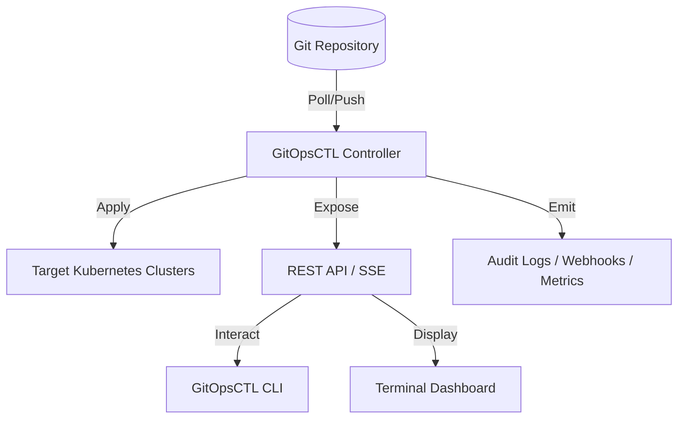

# Architecture

GitOpsCTL operates as an **External Control Plane**. Unlike ArgoCD or FluxCD, it does not necessarily need to run inside the Kubernetes cluster it manages. It can manage multiple remote clusters from a single central location (e.g., a management cluster, a bastion host, or even a local development machine).

## High-Level Diagram



## Core Components

### 1. The Reconciler
The heart of GitOpsCTL. It periodically polls Git repositories, detects changes, and ensures the target cluster matches the desired state in Git.
- **Git Engine**: Handles cloning and pulling repositories securely.
- **Template Engines**: Supports YAML, Kustomize, and Helm.
- **Sync Policies**: Manages `auto` vs `manual` approval workflows.

### 2. Kubernetes Client (`ClientSet`)
A hardened wrapper around `client-go` that provides:
- **Namespace Isolation**: Enforces security boundaries.
- **Health Probing**: Assesses the status of deployed resources.
- **SOPS Decryption**: Intercepts manifests to decrypt secrets on-the-fly.

### 3. API Server
A lightweight Echo-based server that facilitates communication between the controller and the CLI/TUI.
- **Management API**: CRUD operations for apps and clusters.
- **Live Stream (SSE)**: Streams integration events for real-time dashboards.
- **Metrics**: Exposes Prometheus counters and gauges.

### 4. Event Bus
An asynchronous fan-out system that distributes integration events to various sinks (History, SSE, Audit Logs, Webhooks).

## Data Storage

GitOpsCTL is designed to be **stateless**. It stores its configuration in simple JSON files:
- `configs/apps.json`: Application metadata and current synchronization status.
- `configs/clusters.json`: Cluster connection details and security policies.

## Codebase Layout

```txt
main.go                 → Entry: delegates to cmd
cmd/                    → Cobra commands (apps, clusters, start, dashboard)
internal/api/           → Echo server, /api/v1 handlers, SSE logic
internal/controller/    → Reconciliation loop, sync triggers, health checks
internal/core/app/      → Application domain model and persistence
internal/core/cluster/  → Cluster domain model and persistence
internal/core/git/      → Git operations (Clone/Pull/Hash)
internal/core/k8s/      → Kubernetes client and manifest application
internal/common/        → Shared types and validation
internal/events/        → Integration event bus and sinks (Audit, Webhook)
internal/tui/           → Terminal UI (Bubble Tea/Lipgloss)
configs/                → Default directory for JSON stores
```

## Request Flow

1. **Management**: CLI or API updates in-memory stores and persists JSON under `configs/`.
2. **Reconciliation**: `gitopsctl start` loads apps and clusters, starting a goroutine per application.
3. **Loop**: The controller fetches Git at the specified `interval`, compares the commit hash, and applies manifests if needed.
4. **Integration**: Events are emitted to the event bus and fanned out to SSE, Audit Logs, and Webhooks.
5. **Observation**: The TUI dashboard connects to the API via SSE for real-time status updates.
