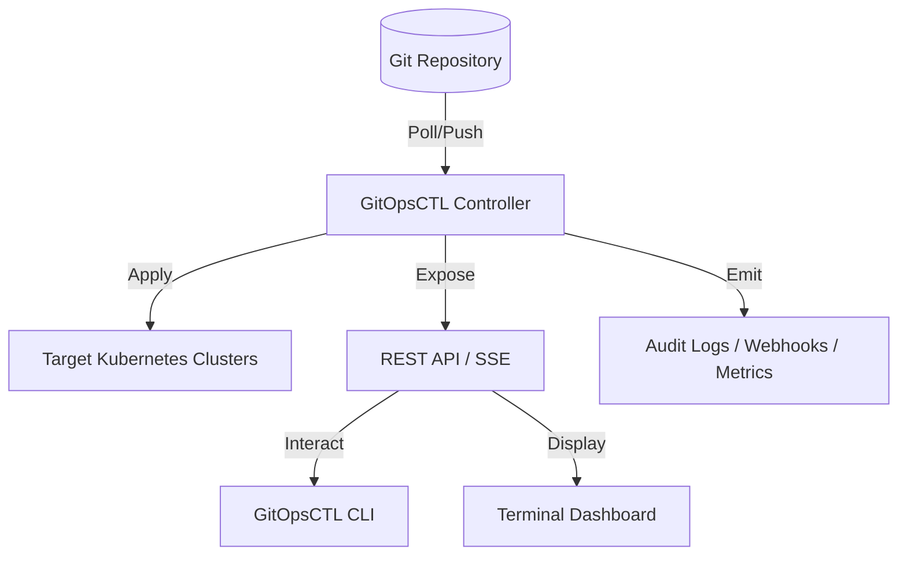

# Architecture

GitOpsCTL operates as an **External Control Plane**. Unlike ArgoCD or FluxCD, it does not necessarily need to run inside the Kubernetes cluster it manages. It can manage multiple remote clusters from a single central location (e.g., a management cluster, a bastion host, or even a local development machine).

## High-Level Diagram

## Core Components

### 1. The Reconciler
The heart of GitOpsCTL. It periodically polls Git repositories, detects changes, and ensures the target cluster matches the desired state in Git.
- **Git Engine**: Handles cloning and pulling repositories securely.
- **Template Engines**: Supports YAML, Kustomize, and Helm.
- **Sync Policies**: Manages `auto` vs `manual` approval workflows.

### 2. Kubernetes Client (`ClientSet`)
A hardened wrapper around `client-go` that provides:
- **Namespace Isolation**: Enforces security boundaries.
- **Health Probing**: Assesses the status of deployed resources.
- **SOPS Decryption**: Intercepts manifests to decrypt secrets on-the-fly.

### 3. API Server
A lightweight Echo-based server that facilitates communication between the controller and the CLI/TUI.
- **Management API**: CRUD operations for apps and clusters.
- **Live Stream (SSE)**: Streams integration events for real-time dashboards.
- **Metrics**: Exposes Prometheus counters and gauges.

### 4. Event Bus
An asynchronous fan-out system that distributes integration events to various sinks (History, SSE, Audit Logs, Webhooks).

## Data Storage

GitOpsCTL is designed to be **stateless**. It stores its configuration in simple JSON files:
- `configs/apps.json`: Application metadata and current synchronization status.
- `configs/clusters.json`: Cluster connection details and security policies.

These files can be backed up or managed via Git (GitOps for your GitOps!).
