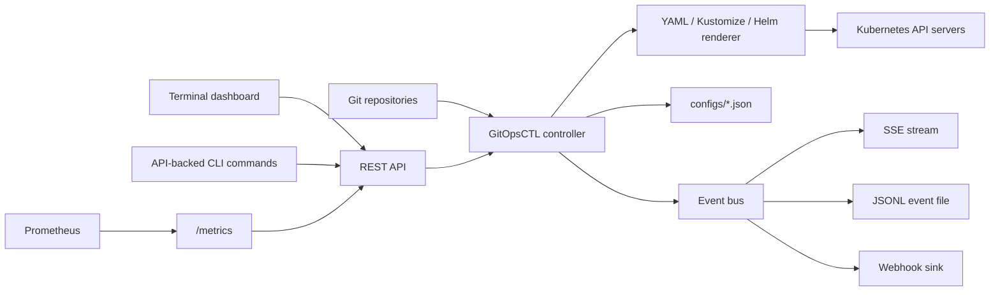
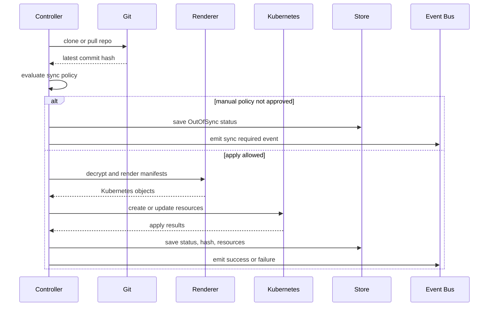

# Architecture

GitOpsCTL is an external GitOps controller. It can run outside the Kubernetes clusters it manages and uses kubeconfig files to connect to those clusters.

## System Diagram



## Runtime Components

### CLI

The CLI is built with Cobra. It handles:

- Cluster registration and removal.
- Application registration and removal.
- Status commands.
- API-backed sync, approval, health-check, and dashboard commands.
- Controller startup.

### Controller

The controller owns reconciliation. On `gitopsctl start`, it:

1. Loads `configs/applications.json`.
2. Loads `configs/clusters.json`.
3. Starts the API server.
4. Starts cluster health checking.
5. Starts a reconciliation worker for each registered app.
6. Watches the app config file for changes and reloads application definitions.

### Git Engine

For each app, GitOpsCTL clones or pulls the configured repository and records the latest commit hash. Sync decisions compare:

- Latest discovered hash.
- Last successfully synced hash.
- Approved hash for manual apps.

### Manifest Engine

GitOpsCTL detects the application manifest mode from the configured `path`:

- Helm chart when `Chart.yaml` or `Chart.yml` exists.
- Kustomize overlay when `kustomization.yaml`, `kustomization.yml`, or `Kustomization` exists.
- Raw YAML for recursive `.yaml` and `.yml` files otherwise.

SOPS decryption runs before render/apply.

### Kubernetes Client

The Kubernetes client wraps `client-go` dynamic clients and REST mapping. It:

- Maps YAML resources to Kubernetes API resources.
- Defaults missing namespaces on namespaced resources to `default`.
- Enforces `allowedNamespaces` when configured on the target cluster.
- Creates missing resources and updates existing resources.
- Tracks applied resource metadata for later health checks.

### API Server

The API server exposes:

- Application and cluster management endpoints.
- Sync, approval, and cluster check endpoints.
- Health endpoint.
- SSE event stream.
- Prometheus metrics endpoint.

The dashboard and API-backed CLI commands use this server.

### Event Bus

The event bus fans out integration events to configured sinks:

- In-memory history for API consumers.
- SSE stream for the dashboard.
- JSONL file for audit trails.
- HTTP webhook for external systems.

## Storage Model

GitOpsCTL intentionally uses simple JSON files as its local store:

- `configs/applications.json`
- `configs/clusters.json`

The controller updates status fields in these files. Back up the directory or keep generated config under infrastructure management if you run GitOpsCTL on a server.

## Reconciliation Flow



## Codebase Layout

```text
main.go                 Entry point
cmd/                    Cobra commands
internal/api/           REST API, validation, SSE stream
internal/controller/    Reconciliation loop and command dispatch
internal/core/app/      Application model and persistence
internal/core/cluster/  Cluster model and persistence
internal/core/git/      Git operations
internal/core/k8s/      Kubernetes render, apply, health logic
internal/core/sops/     SOPS decryption helpers
internal/events/        Event envelope, bus, sinks
internal/metrics/       Prometheus metrics
internal/tui/           Bubble Tea dashboard
internal/utils/         CLI rendering helpers
docs/                   Documentation
examples/               Example configs and manifests
```
